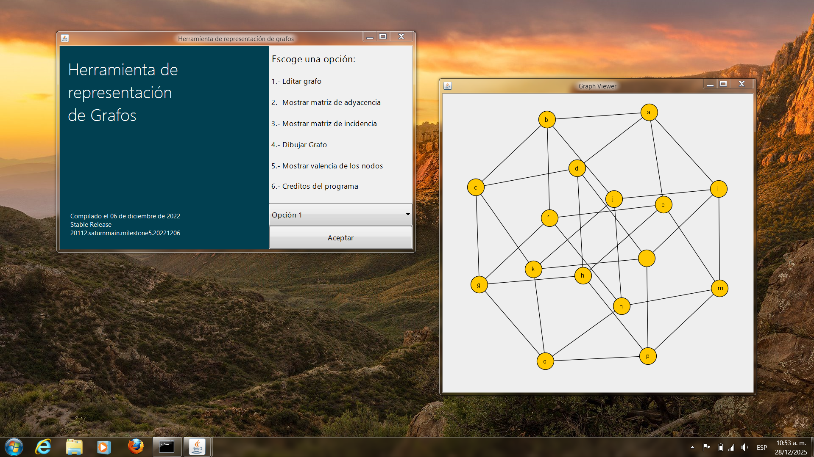

# Herramienta de representación de grafos

Esta herramienta permite representar un grafo a través de sus dos 
representaciones matriciales caracterísitcas, la matriz de adyacencia y la 
matriz de incidencia.

 

## Modo de operación 

El grafo para ser analizado debe de ser introducido de manera que tenga un 
aspecto similar al siguiente ejemplo:

	`(a,b)(b,c)(c,d)(d,a)(a,c)(d,b)`

Donde

 - Las letras que van desde la `a` a la `d` representan nodos
 - Cada par de paréntesis representa una arista

## Capacidades del programa 

 - Soporte para un numero ilimitado de aristas
 - Soporte para hasta 56 nodos
 - Interfaz de usuario amigable
 - Representación de matrices mediante tablas
 - Visualización de grafos mediante el algoritmo de Fruchterman-Reingold
 
 ## Ejemplo de visualización de grafos
 
 
